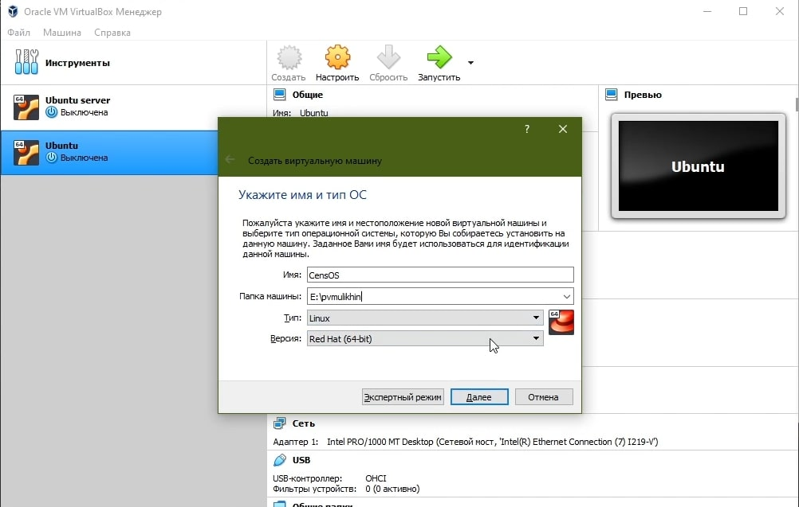
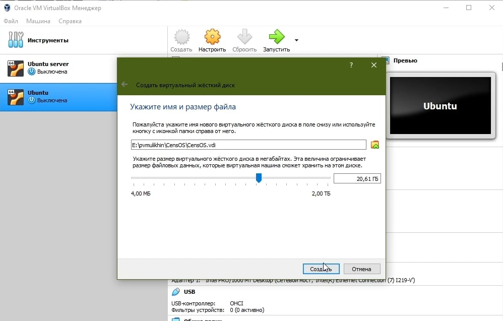
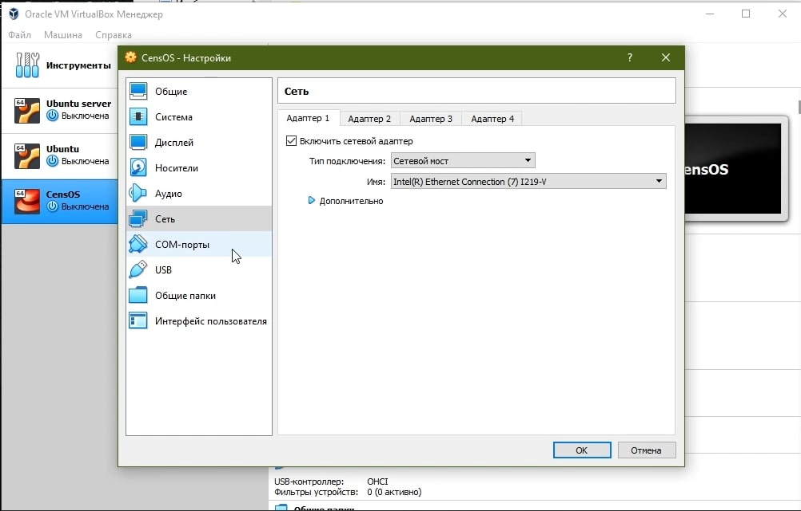
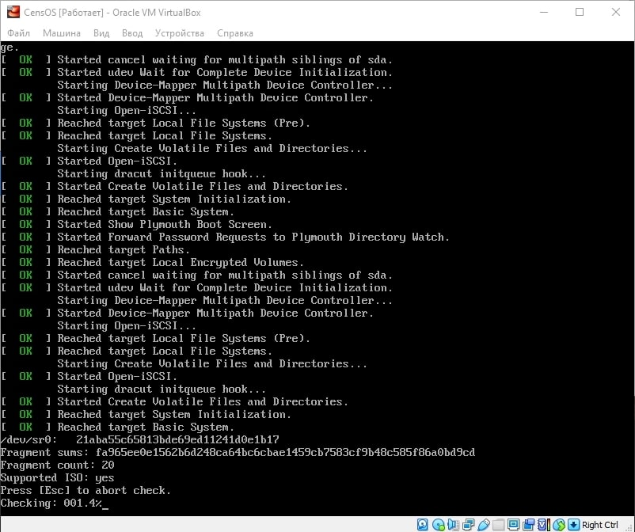
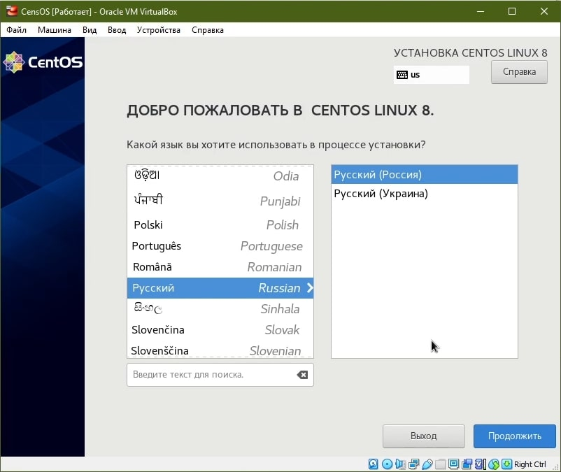
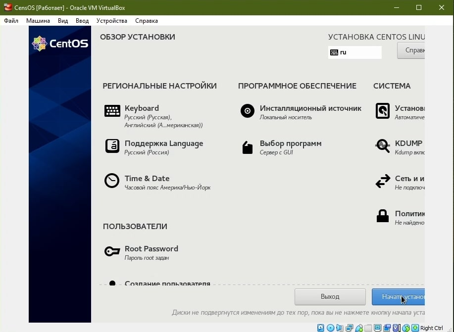
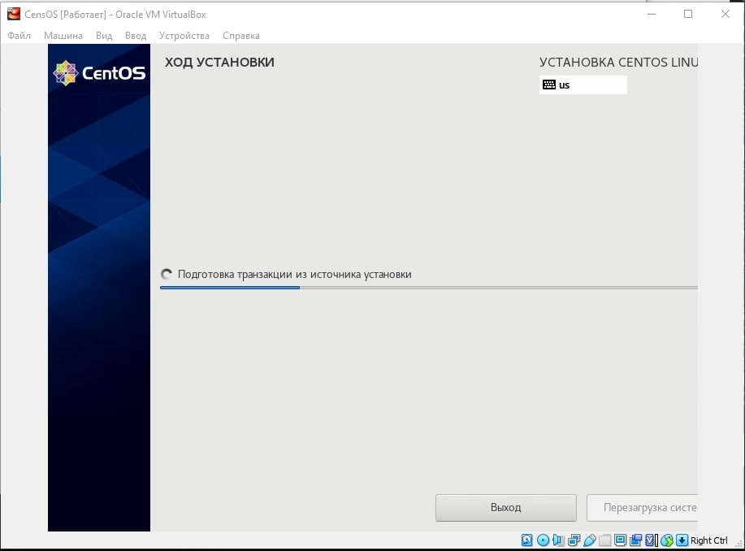
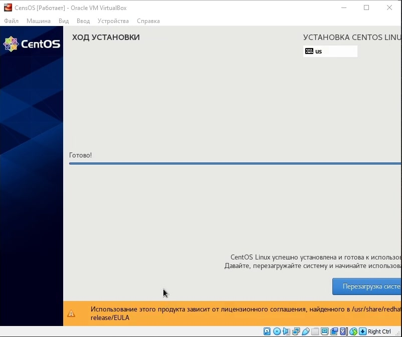
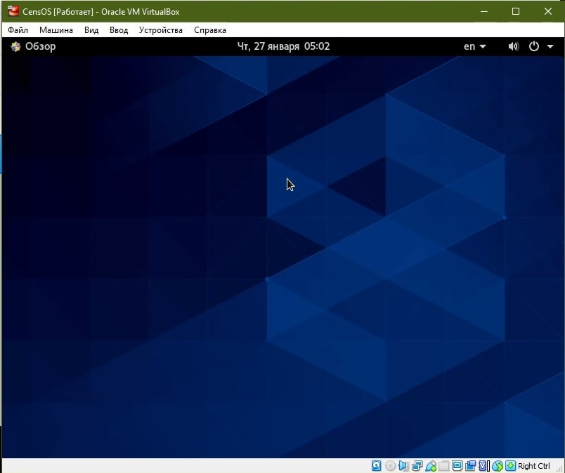

---
## Front matter
lang: ru-RU
title: Дискреционное разграничение прав в Linux. Расширенные атрибуты
author: |
	 Мулихин Павел НФИбд-01-18\inst{1}

institute: |
	\inst{1}Российский Университет Дружбы Народов

date: 27 января, 2022, Москва, Россия

## Formatting
mainfont: PT Serif
romanfont: PT Serif
sansfont: PT Sans
monofont: PT Mono
toc: false
slide_level: 2
theme: metropolis
header-includes: 
 - \metroset{progressbar=frametitle,sectionpage=progressbar,numbering=fraction}
 - '\makeatletter'
 - '\beamer@ignorenonframefalse'
 - '\makeatother'
aspectratio: 43
section-titles: true

---

# Цели и задачи работы

## Цель лабораторной работы

Целью данной работы является приобретение практических навыков установки операционной системы на виртуальную машину, размещение файлов на сервисе Git и подготовка отчета в формате Markdown

# Процесс выполнения лабораторной работы

## Создание виртуальной машины 

{ #fig:001 width=50% }

## Создание виртуального жесткого диска

{ #fig:002 width=50% }

## Предварительная настройка 

{ #fig:003 width=50% }

## Установка OS 

{ #fig:004 width=50% }

## Установка OS 

{ #fig:005 width=50% }

## Установка OS 

{ #fig:006 width=50% }

## Установка OS 

{ #fig:007 width=50% }

## Установка OS 

{ #fig:008 width=50% }

## Запуск ОS

{ #fig:009 width=50% }

# Выводы по проделанной работе

## Вывод

Мы приобрели практические навыки установки операционной системы на виртуальную машину, размещение файлов на сервисе Git и подготовка отчета в формате Markdown