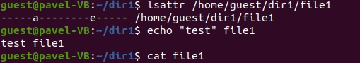

---
## Front matter
lang: ru-RU
title: Дискреционное разграничение прав в Linux. Расширенные атрибуты
author: |
	 Мулихин Павел НФИбд-01-18\inst{1}

institute: |
	\inst{1}Российский Университет Дружбы Народов

date: 30 октября, 2021, Москва, Россия

## Formatting
mainfont: PT Serif
romanfont: PT Serif
sansfont: PT Sans
monofont: PT Mono
toc: false
slide_level: 2
theme: metropolis
header-includes: 
 - \metroset{progressbar=frametitle,sectionpage=progressbar,numbering=fraction}
 - '\makeatletter'
 - '\beamer@ignorenonframefalse'
 - '\makeatother'
aspectratio: 43
section-titles: true

---

# Цели и задачи работы

## Цель лабораторной работы

Получение практических навыков работы в консоли с расширенными атрибутами файлов.

# Процесс выполнения лабораторной работы

## Теоретическое введение 

Помимо прав доступа каждый из файлов стандартной файловой системы Linux имеет набор атрибутов, регламентирующих особенности работы с ним. Chattr — команда, изменяющая атрибуты файлов на файловых системах ext2fs, ext3, ext4 и частично на других файловых системах Linux. Рассмотрим два атрибута:

## Расширенный атрибут а

{ #fig:001 }

{ #fig:002 }

## Расширенный атрибут i

{ #fig:003 }

{ #fig:004 }

## Вывод

Получены практические навыки работы в консоли с расширенными атрибутами файлов. 
