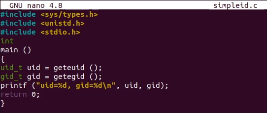
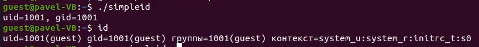
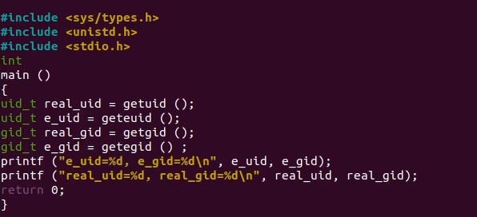

# Лабораторная работа № 3

**Дискреционное разграничение прав в Linux. Два пользователя**

Мулихин Павел

НФИбд-01-18

# Цели и задачи

## Цель лабораторной работы

Получение практических навыков работы в консоли с атрибутами файлов для групп пользователей.

# Выполнение лабораторной работы

## Определяем UID и группу двух пользователей

{ #fig:001 width=70% }

## Файл с данными о пользователях

{ #fig:002 width=70% }

## Атрибуты директории

{ #fig:003 width=70% }

# Выводы

## Результаты выполнения лабораторной работы

В ходе выполнения лабораторной работы было разработано приложение, позволяющее шифровать тексты в режиме однократного гаммирования.